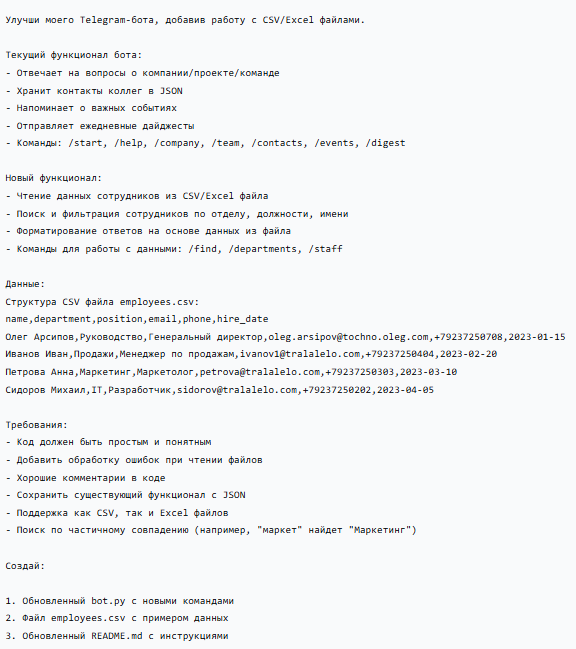
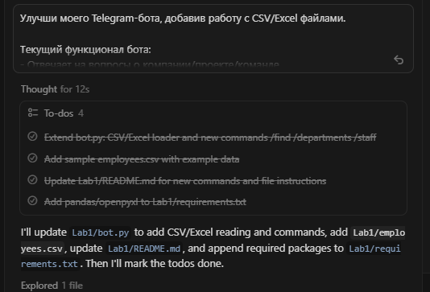
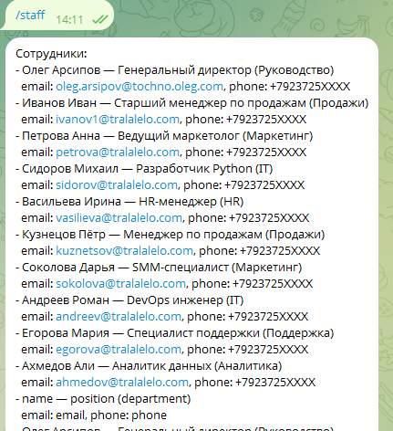
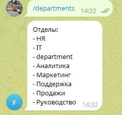

University: ITMO University
Faculty: FICT
Course: Блокчейн и его применения
Year: 2025/2026
Group: U4225
Author: Pochuev Danil Valerevich
Lab: Lab2
Date of create: 31.10.2025
Date of finished: 31.10.2025

### Лабораторная работа 2 — «Расширение Telegram-бота: работа с CSV/Excel»

#### Описание
Доработан Telegram-бот компании для работы с данными сотрудников из CSV/Excel: чтение, фильтрация и поиск. Сохранён существующий функционал на JSON и добавлены новые команды.

#### Цель работы
Добавить в бота поддержку импорта кадровых данных из файлов и обеспечить быстрый поиск/фильтрацию по отделу, должности и имени с частичными совпадениями.

#### Правила по оформлению
Отчёт оформлен в формате Markdown и включает цель, ход выполнения, результаты и выводы.

---

### Ход работы

1) Постановка задачи
- Требования: чтение CSV/Excel, поиск по частичному совпадению, сохранение базовой логики бота, обработка ошибок.
- Новые команды: `/departments`, `/staff [отдел]`, `/find <строка>`.

2) Подготовка данных
- Создан файл `Lab2/employees.csv` со столбцами: `name, department, position, email, phone, hire_date`.
- Добавлены примерные сотрудники по отделам: Руководство, Продажи, Маркетинг, IT, HR, Поддержка, Аналитика.
- Телефоны замаскированы (последние 4 цифры — `XXXX`).

3) Реализация в коде
- Обновлён `Lab2/bot.py`:
  - Загрузка из `employees.csv` или `employees.xlsx` (если CSV отсутствует).
  - Проверка наличия обязательных колонок, логирование ошибок.
  - Частичный поиск (регистронезависимый) по полям `name`, `department`, `position`.
  - Форматирование кратких карточек сотрудника в ответе.
- Добавлены зависимости `pandas` и `openpyxl` в `Lab2/requirements.txt`.

4) Обновление документации
- В `Lab2/README.md` добавлены инструкции по работе с данными сотрудников и примеры команд.

5) Проверка
- Запуск бота из папки `Lab2` и тестирование:
  - `/departments` — список доступных отделов.
  - `/staff Продажи` — сотрудники отдела Продажи.
  - `/find маркет` — результат поиска по частичному совпадению.

---

### Результаты
- Бот поддерживает загрузку кадровых данных из CSV/Excel и интерактивный поиск.
- Сохранена совместимость с существующими JSON-данными (`company`, `team`, `contacts`, `events`, `digests`).
- Обеспечена обработка ошибок при чтении файлов и отсутствии колонок.

### Выводы
Расширение с использованием `pandas` и `openpyxl` позволило интегрировать структурированные табличные данные без изменения архитектуры бота. Реализованные фильтры и поиск повышают прикладную ценность бота для внутренних пользователей.

