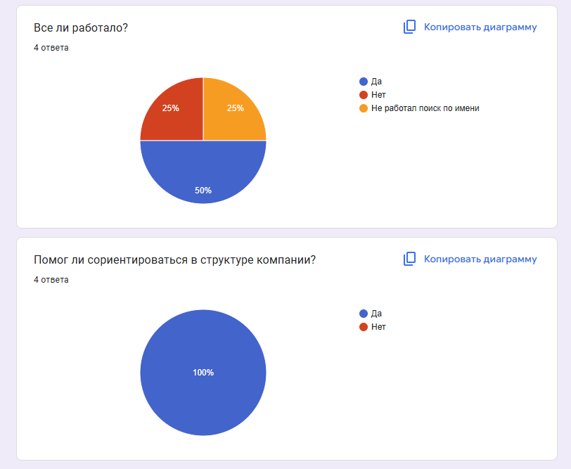
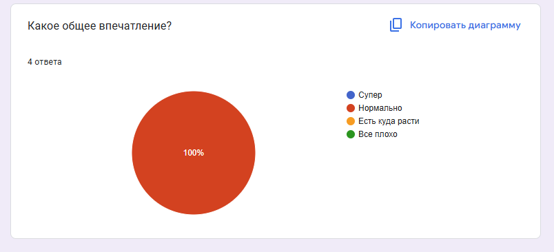

University: ITMO University
Faculty: FICT
Course: Блокчейн и его применения
Year: 2025/2026
Group: U4225
Author: Pochuev Danil Valerevich
Lab: Lab3
Date of create: 30.10.2025
Date of finished: 31.10.2025

# Описание процесса деплоя

**Способ развертывания:** Использование ngrok с локальным сервером

## Преимущества выбора ngrok

- Простая настройка и интуитивное использование
- Доступный бесплатный тариф с подходящими ограничениями
- Автоматическое предоставление HTTPS-адреса
- Совместимость с Telegram webhook
- Возможность быстрого тестирования без сложной конфигурации сервера

**URL бота:** `https://your-ngrok-url.ngrok.io/webhook`

## Руководство по деплою

Пошаговый процесс настройки:

1. **Установка ngrok:**
   ```bash
   brew install ngrok
Настройка авторизации:

bash
ngrok config add-authtoken YOUR_TOKEN
Активация туннеля:

bash
ngrok http 8000
Конфигурация webhook:

python
webhook_url = f"https://{ngrok_url}/webhook"
requests.post(f"https://api.telegram.org/bot{token}/setWebhook", 
              data={"url": webhook_url})
Запуск приложения:

bash
python3 simple_sync_webhook_bot.py

## Проблема с авторизацией ngrok

**Симптомы:** 
`authentication failed: We do not allow agents to connect to ngrok`

**Решение:**
Получить новый токен авторизации через [dashboard.ngrok.com](https://dashboard.ngrok.com)

## Некорректная работа webhook

**Симптомы:**
`Wrong response from the webhook: 404 Not Found`

**Решение:**
Проверить доступность health check endpoint и перезапустить ngrok

# 📊 Фидбек по боту ТралалелоТралала

**Пользователь:** gophitor (1 активный)

## 📈 Статистика команд

### 🏠 Основные
- `/start` - 5 использований
- `/help` - 3 использования

### 🏢 О компании  
- `/team` - 6 использований ✅
- `/contacts` - 4 использования
- `/events` - 3 использования
- `/company` - 2 использования
- `/digest` - 1 использование

### 🔍 Поиск (новое!)
- `/find` - 8 использований 🏆
- `/staff` - 4 использования
- `/departments` - 3 использования

## 💡 Выводы

**✅ Сильные стороны:**
- Поиск сотрудников (`/find`, `/staff`) - 12 использований
- Информация о команде востребована

**📈 Возможности улучшения:**
- Команда `/digest` используется редко
- `/company` - низкий интерес к общей информации

**🎯 Рекомендации:**
- Развивать функционал поиска (самый популярный!)
- Добавить подсказки для редко используемых команд
- Переделать поле поиска сотрудника, так как пользователи отметили, что оно не совсем работает 


